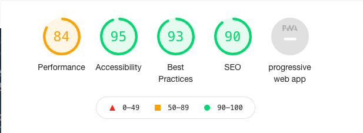
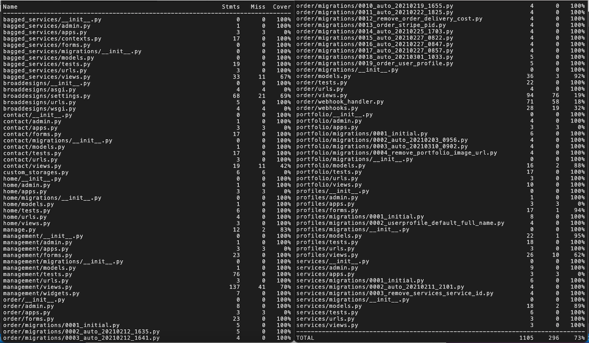

<h1>Broad Designs</h1>
<h3>Fourth Milestone Project: Full Stack Frameworks with Django - Code Institute</h3>
<h4>By Lewis Hamilton</h4>

Welcome to <a href="https://broad-designs.herokuapp.com/" rel="nofollow" target="_blank">Broad Designs</a>!

<a href="https://broad-designs.herokuapp.com/" rel="nofollow" target="_blank">Broad Designs</a> Is a graphic design/software development business built using Django.

 

<a href="https://broad-designs.herokuapp.com/" rel="nofollow" target="_blank">Broad Designs</a> allows users to explore the portfolios of previous work, look through all the services provided, contact them via different channels (email or instant messenger), create a profile and start an order on their own project with email confirmations, order history and online payments.

 

This exciting application creates a simple, fuss free route for users to obtain professional designs and applications, with direct lines of communication like the <a href="https://www.tawk.to/" rel="nofollow" target="_blank">Tawk.to</a> instant messenger API for quick and simple responses to questions.

 

If you have any issues with the app, please head over to the <a href="https://broad-designs.herokuapp.com/" rel="nofollow" target="_blank">Broad Designs</a> page and fill out a contact form or simply open the chat app and someone will get back to you as soon as possible.

 
<h3>Demo</h3>

A live demo can be found here <a href="https://broad-designs.herokuapp.com/" rel="nofollow" target="_blank">here</a>.

 
<h2>Table of Contents</h2>
<ol>
<li>

<a href="#ux"><strong>UX</strong></a>

<ul>
<li><a href="#db-schema"><strong>Database</strong></a></li>
<li><a href="#user-stories"><strong>User Stories</strong></a></li>
<li><a href="#design-choices"><strong>Design choices</strong></a></li>
<li><a href="#wireframes"><strong>Wireframes</strong></a>
<ul>
<li><a href="#variation-between-wireframes-and-final-product">Variation Between Wireframes and Final Product</a></li>
</ul>
</li>
</ul>
</li>
<li>

<a href="#technologies-used"><strong>Technologies Used</strong></a>

<ul>
<li><a href="#front-technologies-used"><strong>Front End Technologies</strong></a>
</li>
<li><a href="#back-technologies-used"><strong>Back End Technologies</strong></a>
</li>
</ul>
</li>
<li>

<a href="#features"><strong>Features</strong></a>

<ul>
<li><a href="#existing-features"><strong>Existing Features</strong></a></li>
<li><a href="#features-to-be-implemented"><strong>Features To Be Implemented</strong></a></li>
</ul>
</li>
<li>

<a href="#testing"><strong>Testing</strong></a>

</li>
<li>

<a href="#deployment"><strong>Deployment</strong></a>

<ul>
<li><a href="#local-deployment"><strong>Local Deployment</strong></a></li>
<li><a href="#remote-deployment"><strong>Remote Deployment</strong></a></li>
</ul>
</li>
<li>

<a href="#credits"><strong>Credits</strong></a>

<ul>
<li><a href="#api"><strong>Images and Data</strong></a></li>
<li><a href="#logo"><strong>Fonts</strong></a></li>
<li><a href="#code-credits"><strong>Code Credits</strong></a></li>
<li><a href="#learning-resources"><strong>Learning Resources</strong></a></li>
<li><a href="#acknowledgements"><strong>Acknowledgements</strong></a></li>
</ul>
</li>
<li>

<a href="#disclaimer"><strong>Disclaimer</strong></a>

</li>
</ol>
<h2><strong>UX</strong></h2>

This project is part of my <a href="https://codeinstitute.net/" rel="nofollow" target="_blank">Code Institute</a> Full Stack Software Development studies, specifically the Full Stack Frameworks module. The objective for this milestone project is to "Create a web application that allows users to discuss and order a specific graphic design or software development works to be carried out, where payment can be processed via the website, and email confirmatons and order history is provided to them".

 
<h3>Database Schema</h3>

<a href="https://en.wikipedia.org/wiki/PostgreSQL" rel="nofollow">PostgreSQL</a> was used to create the database for this application.

The final database schema consists of four collections which include users, services, portfolio and orders.

 
<h3>User stories</h3>

"<strong><em>As a user, I would like to</em></strong> _______________"

<g-emoji class="g-emoji" alias="white_check_mark" fallback-src="https://github.githubassets.com/images/icons/emoji/unicode/2705.png">✅</g-emoji> <em>successfully implemented</em>

<g-emoji class="g-emoji" alias="x" fallback-src="https://github.githubassets.com/images/icons/emoji/unicode/274c.png">❌</g-emoji> <em>not yet implemented</em>

<ul>
<li><g-emoji class="g-emoji" alias="white_check_mark" fallback-src="https://github.githubassets.com/images/icons/emoji/unicode/2705.png">✅</g-emoji> <em>view the site</em> from <strong>any device</strong> <em>(mobile, tablet, desktop)</em>.</li>
<li><g-emoji class="g-emoji" alias="white_check_mark" fallback-src="https://github.githubassets.com/images/icons/emoji/unicode/2705.png">✅</g-emoji> <em>see</em> information on what services the site provides.</li>
<li><g-emoji class="g-emoji" alias="white_check_mark" fallback-src="https://github.githubassets.com/images/icons/emoji/unicode/2705.png">✅</g-emoji> <em>have exclusive services for <strong>account holders</strong>.</li>
<li><g-emoji class="g-emoji" alias="white_check_mark" fallback-src="https://github.githubassets.com/images/icons/emoji/unicode/2705.png">✅</g-emoji> <em>create</em> my own <strong>profile</strong>.</li>
<li><g-emoji class="g-emoji" alias="white_check_mark" fallback-src="https://github.githubassets.com/images/icons/emoji/unicode/2705.png">✅</g-emoji> <em>update</em> my <strong>profile</strong> information.</li>
<li><g-emoji class="g-emoji" alias="white_check_mark" fallback-src="https://github.githubassets.com/images/icons/emoji/unicode/2705.png">✅</g-emoji> <em>view</em> a portfolio of work that has been done in a <em>clear and simple way</em>.</li>
<li><g-emoji class="g-emoji" alias="white_check_mark" fallback-src="https://github.githubassets.com/images/icons/emoji/unicode/2705.png">✅</g-emoji> <em>process</em> my <strong>orders</strong> with <em>ease</em>.</li>
<li><g-emoji class="g-emoji" alias="white_check_mark" fallback-src="https://github.githubassets.com/images/icons/emoji/unicode/2705.png">✅</g-emoji> <em>submit</em> my own <strong>questions</strong> in a fast and reliable way.</li>
<li><g-emoji class="g-emoji" alias="white_check_mark" fallback-src="https://github.githubassets.com/images/icons/emoji/unicode/2705.png">✅</g-emoji> <em>find</em> the location of the buisness and have their address if need be.</li>
<li><g-emoji class="g-emoji" alias="white_check_mark" fallback-src="https://github.githubassets.com/images/icons/emoji/unicode/2705.png">✅</g-emoji> <em>forgot password functionality</em> for <strong>security</strong> and to stop being locked out of my account.</li>
<li><g-emoji class="g-emoji" alias="white_check_mark" fallback-src="https://github.githubassets.com/images/icons/emoji/unicode/2705.png">✅</g-emoji> be able to <strong>log out</strong>.</li>
<li><g-emoji class="g-emoji" alias="white_check_mark" fallback-src="https://github.githubassets.com/images/icons/emoji/unicode/2705.png">✅</g-emoji> be able to <strong>change my password</strong>.</li>
<li><g-emoji class="g-emoji" alias="white_check_mark" fallback-src="https://github.githubassets.com/images/icons/emoji/unicode/2705.png">✅</g-emoji> <em>see</em> an <strong>updated total</strong> as I add <em>services</em> to my order.</li>
<li><g-emoji class="g-emoji" alias="white_check_mark" fallback-src="https://github.githubassets.com/images/icons/emoji/unicode/2705.png">✅</g-emoji> <em>recieve</em> <strong>email confirmations</strong> of my orders.</li>
<li><g-emoji class="g-emoji" alias="white_check_mark" fallback-src="https://github.githubassets.com/images/icons/emoji/unicode/2705.png">✅</g-emoji> <em>upload</em> <strong>a useful image</strong> with my order like a logo or design inspiration.</li>
<li><g-emoji class="g-emoji" alias="x" fallback-src="https://github.githubassets.com/images/icons/emoji/unicode/274c.png">❌</g-emoji> <em>see</em> information on what's included with each <em>service</em>.</li>
</ul>
<h2>Design Choices</h2>
<h3>Colours</h3>
<ul>
<li>

<strong>Navbar</strong> - I decided to use bootstraps <code>#f8f9fa</code>(Light grey) as I feel this colour is clean and simple with a professional look.

</li>
<li>

<strong>Buttons and Icons</strong> - I decided to use bootstraps #198754(green), #dc3545(red) and #0d6efd(blue) which represents add, confirmation or cancel. Also it stands out against the coloured and white backgrounds.

</li>
<li>

<strong>Font Colour</strong> - The main colours I decided to use <code>#555</code>(Dark grey) &amp; <code>#FFFFFF</code>(White) for the text as it keeps with the simplistic theme, but also stands out against the background colours.

</li>
</ul>
<h3>Fonts</h3>
<ul>
<li>

<a href="https://fonts.google.com/specimen/Poppins?preview.text_type=custom" rel="nofollow"><strong>Poppins</strong></a> - I used this font throughout the site, as I feel it fit in with the clean design, while also bold enough to stand out for readability.

</li>
</ul>
<h3>Icons</h3>
<ul>
<li>

<a href="https://fontawesome.com/" rel="nofollow"><strong>Font Awesome</strong></a> - Although there are other sites that provide icons, I prefer the look of the Font Awesome icons, and they have significantly more icons to use. They aren't displayed using text, but rather classes, so use on mobile devices isn't affected.

</li>
</ul>
<h3>Wireframes</h3>
<ul>
<li>

The wireframes for the initial layout in the planning stage of the website were created using <a href="https://balsamiq.com/" rel="nofollow">Balsamiq</a>. I chose to use Balsamiq for their simplicity and ease of use in a quick and effective manner. You can view the wireframes for Broad Design <a href="https://github.com/lewejuice/broad-designs/tree/master/media/wireframes">here</a>.

</li>
<li>

The wireframes include a design layout for Desktop and Mobile.

</li>
<li>

The colour scheme I had in mind when designing the mockups was not available on the site.

</li>
</ul>
<h4>Variation Between Wireframes and Final Product</h4>

I didn't really make many changes from the wireframes to the final product, as I wanted to follow the plan I had laid out. The few things I did change or add were:

<ul>
<li>I added a google maps location on the contact page.</li>
<li>I also added more of an introduction on the home-page which I hadn't originally planned, but I thought it gave better instruction to the user as to who/what the site was.</li>
</ul>
<h4>Landing Page</h4>
<ul>
<li>For the homescreen I changed to show multiple catergories with movie posters to engage users instantly, instead of having them navigate to a categorie.</li>
</ul>
<h4>Modal</h4>
<ul>
<li>I did not include the design for my modal as I thought, instead of loading a new page, a modal window pop up is more efficient.</li>
</ul>
<h2>Technologies Used</h2>
<ol>
<li>

<a href="https://balsamiq.com/" rel="nofollow">Balsamiq</a> - Used to bring my wireframe sketches to life.

</li>
<li>

<a href="https://en.wikipedia.org/wiki/Adobe_Illustrator" rel="nofollow">Adobe Illustrator</a> - Used for building the website logo.

</li>
<li>

<a href="https://github.com/">GitHub</a> - I used to store my repository for the project and record all my commits.

</li>
<li>

<a href="https://www.gitpod.io/" rel="nofollow">Gitpod</a> - Used as my primary IDE for developing projects.

</li>
</ol>
<h3>Front End Technologies</h3>
<ol>
<li>

<a href="https://getbootstrap.com/" rel="nofollow">Bootstrap v5.0.0</a> - Although this framework is only in beta, I found it had some new smart features that older version did not have while also maintaining bootstraps modern and clean layout with its simple-to-understand documentation.

</li>
<li>

<a href="https://en.wikipedia.org/wiki/HTML" rel="nofollow">HTML</a> - This was used for the overall structure of the website.

</li>
<li>

<a href="https://en.wikipedia.org/wiki/Cascading_Style_Sheets" rel="nofollow">CSS</a> - This was used for the styling of elements on the website.

</li>
<li>

<a href="https://en.wikipedia.org/wiki/JavaScript" rel="nofollow">JavaScript</a> - This was mainly used to retrieve and display data from the API, but also a couple small animations i.e displaying the modals.

</li>
<li>

<a href="https://en.wikipedia.org/wiki/JQuery" rel="nofollow">jQuery</a> - In an effort to keep the JavaScript minimal, I have decided to use jQuery in my my scripts.

</li>
<li>

<a href="https://getbootstrap.com/" rel="nofollow">Bootstrap5</a> - Used as the front-end framework for layout and design.

</li>
<li>

<a href="https://dashboard.stripe.com/login" rel="nofollow">Stripe API</a> - Used to make secured payments on Orders.

</li>
<li>

<a href="https://aws.amazon.com/" rel="nofollow">Amazon AWS S3</a> - Used to store staticfiles and media folders and files.

</li>
<li>

<a href="https://developers.google.com/maps" rel="nofollow">Google Maps API</a> - Used to display the location of the buisness on the contact page.

</li>
<li>

<a href="https://www.tawk.to/" rel="nofollow">Tawk.to API</a> - Used as an instant messenger for users to be able to ask questions and get quick responses.

</li>
<li>

<a href="https://fonts.google.com/" rel="nofollow">Google Fonts</a> - I used Google Fonts to source the fonts I used on the website.

</li>
</ol>
<h3>Back End Technologies</h3>
<ol>
<li>

<a href="https://en.wikipedia.org/wiki/Python_(programming_language)" rel="nofollow">Python3</a> - Used as the back-end programming language.

</li>
<li>

<a href="https://www.djangoproject.com/download/" rel="nofollow">Django 3.1.5</a> - Django is a free and open-source web framework that I've used to render the back-end Python with the front-end Bootstrap.

</li>
<li>

<a href="https://www.postgresql.org/" rel="nofollow">PostgreSQL</a> - Used to store all the data in an organised database.

</li>
<li>

<a href="https://dashboard.heroku.com/apps" rel="nofollow">Heroku</a> - Used for "Platform as a Service" (PaaS) for app hosting.

</li>
</ol>

Further details on all Python packages used on this project can be found in the <a href="https://github.com/lewejuice/broad-designs/blob/master/requirements.txt" rel="nofollow">requirements.txt file</a>. Each of these is outlined below (click below to expand the dropdown), with the package version and a brief description.

CLICK HERE to expand the full <b>requirements.txt</b> details.

<table>
<thead>
<tr>
<th align="left">Package</th>
<th align="left">Version</th>
<th align="left">Description</th>
</tr>
</thead>
<tbody>
<tr>
<td align="left">asgiref</td>
<td align="left">3.3.1</td>
<td align="left">Standard for Python asynchronous web apps and servers to communicate with each other</td>
</tr>
<tr>
<td align="left">boto3</td>
<td align="left">1.17.30</td>
<td align="left">The AWS SDK for Python</td>
</tr>
<tr>
<td align="left">botocore</td>
<td align="left">1.20.30</td>
<td align="left">Foundation for AWS-CLI command line utilities</td>
</tr>
<tr>
<td align="left">crispy-bootstrap5</td>
<td align="left">0.2</td>
<td align="left">To run crispy-forms with bootstrap5</td>
</tr>
<tr>
<td align="left">dj-database-url</td>
<td align="left">0.5.0</td>
<td align="left">A utility to help you load your database into your dictionary from the DATABASE_URL environment variable</td>
</tr>
<tr>
<td align="left">Django</td>
<td align="left">3.1.5</td>
<td align="left">the Django framework</td>
</tr>
<tr>
<td align="left">django-allauth</td>
<td align="left">0.44.0</td>
<td align="left">Integrated set of Django applications addressing authentication, registration, account management as well as 3rd party (social) account authentication.</td>
</tr>
<tr>
<td align="left">django-countries</td>
<td align="left">7.0</td>
<td align="left">A Django application that provides country choices for use with forms</td>
</tr>
<tr>
<td align="left">django-crispy-forms</td>
<td align="left">1.11.0</td>
<td align="left">An application that helps to manage Django forms</td>
</tr>
<tr>
<td align="left">django-forms-bootstrap</td>
<td align="left">3.1.0</td>
<td align="left">An application that enables you to use bootstrap classes in Django forms</td>
</tr>
<tr>
<td align="left">django-storages</td>
<td align="left">1.11.1</td>
<td align="left">Connects Django to S3 Buckets</td>
</tr>
<tr>
<td align="left">gunicorn</td>
<td align="left">20.0.4</td>
<td align="left">A Python WSGI HTTP Server for UNIX</td>
</tr>
<tr>
<td align="left">jmespath</td>
<td align="left">0.10.0</td>
<td align="left">Allows you to declaratively specify how to extract elements from a JSON document</td>
</tr>
<tr>
<td align="left">oauthlib</td>
<td align="left">3.1.0</td>
<td align="left">A framework which implements the logic of OAuth1 or OAuth2 without assuming a specific HTTP request object or web framework</td>
</tr>
<tr>
<td align="left">Pillow</td>
<td align="left">8.1.0</td>
<td align="left">Adds support for opening, manipulating, and saving many different image file formats</td>
</tr>
<tr>
<td align="left">psycopg2-binary</td>
<td align="left">2.8.6</td>
<td align="left">Python-PostgreSQL Database Adapter</td>
</tr>
<tr>
<td align="left">PyJWT</td>
<td align="left">2.0.1</td>
<td align="left">Python library which allows you to encode and decode JSON Web Tokens</td>
</tr>
<tr>
<td align="left">python3-openid</td>
<td align="left">3.2.0</td>
<td align="left">The reference library for OpenID in Python</td>
</tr>
<tr>
<td align="left">pytz</td>
<td align="left">2020.5</td>
<td align="left">This library allows accurate and cross platform timezone calculations</td>
</tr>
<tr>
<td align="left">requests-oauthlib</td>
<td align="left">1.3.0</td>
<td align="left">Makes requests simpler and more human-friendly</td>
</tr>
<tr>
<td align="left">s3transfer</td>
<td align="left">0.3.4</td>
<td align="left">Python library for managing Amazon S3 transfers</td>
</tr>
<tr>
<td align="left">sqlparse</td>
<td align="left">0.4.1</td>
<td align="left">Non-validating SQL parser</td>
</tr>
<tr>
<td align="left">stripe</td>
<td align="left">2.55.2</td>
<td align="left">Python library for Stripe’s API</td>
</tr>
</tbody>
</table>

<h2>Features</h2>
<h3>Existing Features</h3>

In accordance to the project brief, I have successfully implemented all of the required features, as well as a few additional features to improve user experience!

<strong>Register Account</strong> <g-emoji class="g-emoji" alias="bust_in_silhouette" fallback-src="https://github.githubassets.com/images/icons/emoji/unicode/1f464.png">👤</g-emoji> <g-emoji class="g-emoji" alias="heavy_plus_sign" fallback-src="https://github.githubassets.com/images/icons/emoji/unicode/2795.png">➕</g-emoji>

<ul>
<li>Anybody can register for free and create their own unique account. This is built using Allauth's authentication and authorization to validate profile data.</li>
</ul>

<strong>Change Password</strong> <g-emoji class="g-emoji" alias="closed_lock_with_key" fallback-src="https://github.githubassets.com/images/icons/emoji/unicode/1f510.png">🔐</g-emoji>

<ul>
<li>Users can update their passwords from their profile page. They will receive an email with instructions on how to reset the password.</li>
</ul>

<strong>Contact <g-emoji class="g-emoji" alias="speech_balloon" fallback-src="https://github.githubassets.com/images/icons/emoji/unicode/1f4ac.png">💬</g-emoji></strong>

<ul>
<li>Users can ask questions via a contact form, instant chat or details of address, contact number and email are provided.</li>
</ul>

<strong>View Portfolio</strong>

<ul>
<li>Users can see a portfolio of work organised in to catergories of design and code.</li>
</ul>

<strong>View Services</strong>

<ul>
<li>Users can see a list of services the company provides and an explaination.</li>
</ul>

<strong>Add and Remove Services to Order</strong>

<ul>
<li>Users can add and remove services from their order.</li>
</ul>

<strong>Updated Total</strong>

<ul>
<li>Users get an updated total as they add and remove services.</li>
</ul>

<strong>Upload Image</strong>

<ul>
<li>Users can upload an image with their order, like a logo or design inspiration.</li>
</ul>

<strong>Email Confirmations</strong>

<ul>
<li>Users recieve email confirmations including all the information of their order.</li>
</ul>

<strong>Order History</strong>

<ul>
<li>Users can look through their order history and click on certain orders to open that orders details page up.</li>
</ul>

<strong>Toasts</strong>

<ul>
<li>Users will get toast popups to show errors, successes etc. All toasts are displayed with the company logo and message along with it.</li>
</ul>

<strong>Admin Status</strong> <g-emoji class="g-emoji" alias="police_officer" fallback-src="https://github.githubassets.com/images/icons/emoji/unicode/1f46e.png">👮</g-emoji>

<ul>
<li>As Admin (ie: superuser), there are quite a few additional features across the site that no other user has access to. The account tab on the navbar has additional management option so they can add, edit and delete services and projects. They can also see a table of all the orders made and click on each order to get their details.</li>
</ul>
<h3>Features To Be Implemented</h3>

<strong>Information buttons</strong>

<ul>
<li>On the forms, I would like to add information buttons where if a user clicks, it will give a helper as to what that field needs.</li>
</ul>

<strong>Delete Account</strong>

<ul>
<li>Users should be given the opportunity to delete their account entirely. Currently they can register and edit their data, but not remove it from the database.</li>
</ul>
<h2>Testing</h2>

A thorough mix of automated and manual testing have gone into building this project. In addition to tests, I have validated all files against online validation sites, and checked compatibilities across various modern browsers and devices.

<h3>Validators</h3>

<strong>HTML</strong>

<ul>
<li><a href="https://validator.w3.org" rel="nofollow">W3C HTML Validator</a></li>
</ul>

<strong>CSS</strong>

<ul>
<li><a href="https://validator.w3.org" rel="nofollow">W3C CSS Validator</a></li>
</ul>

<strong>JavaScript</strong>

<ul>
<li><a href="https://jshint.com/" rel="nofollow">JShint</a></li>
<li><a href="http://beautifytools.com/javascript-validator.php" rel="nofollow">Beautify Tools</a></li>
</ul>
</li>

<strong>Python</strong>

<ul>
<li><a href="http://pep8online.com/" rel="nofollow">PEP8 Online</a></li>
</ul>
<h3>Compatibility</h3>

To ensure a broad range of users can successfully use the site, I tested it across the 6 major browsers in both desktop and mobile configuration.

<ul>
<li><strong>Chrome</strong> (<em>v.89.0.4389.90</em>)</li>
<li><strong>Edge</strong> (<em>v.89.0.774.63</em>)</li>
<li><strong>Firefox</strong> (<em>v.87.0</em>)</li>
<li><strong>Safari</strong> (<em>v.14.0.3</em>)</li>
<li><strong>Opera</strong> (<em>v.74.0.3911.232</em>)</li>
<li><strong>Internet Explorer</strong> (<em>v.11.0.11</em>)</li>
</ul>
<h3>Testing Matrix</h3>

<h3>Chrome's DevTools Audit Report</h3>

<h3>Automated Testing</h3>

With Django's built-in <code>unittest</code> library module and <code>TestCase</code> subclass, I built <strong>30</strong> different tests to encompass most of my python <em>views</em> and <em>forms</em>. Using the <a href="https://coverage.readthedocs.io/en/v4.5.x/" rel="nofollow">coverage.py</a> test package, those 30 tests have provided an overall result of <strong>73% test coverage</strong>, which is within the approved minimum requirement for testing. All tests pass as '<em>OK</em>'! Most of the remaining Python that I didn't manually build tests for, are built-in Django boilerplates, core functionality and I did not manage to test the views on the Order app which I would like to add at a later date. Below is a full table with the entire breakdown of the <strong>Coverage Report</strong> - click to expand the dropdown menu.

CLICK HERE to expand the full <b>Coverage Report</b>

<h3>Bugs</h3>
<h4>HTML</h4>
<ul>
<li>All <strong>.html</strong> files checked.</li>
<li><strong>base.html</strong> file contained minor errors that have since been rectified (<em>Had a button element within an anchor element and type inside script tag for JS</em>). <a href="https://github.com/lewejuice/broad-designs/commit/master">Correction Commit: f1e7c6a301ede885654d9960234424e4716650ce</a></li>
<li><strong>Error</strong>: Had a button element within an anchor element.</li>
<li><strong>Error</strong>: Type inside script tag for JS.</li>
<li>The remaining validation issues are all attributed to comments made with hyphens to organise sections of code:
<ul>
<li><strong>Warning</strong>: The document is not mappable to XML 1.0 due to two consecutive hyphens in a comment.</li>
</ul>
</li>
</ul>
<h4>CSS</h4>
<ul>
<li>No bugs found.</li>
</ul>
<h4>JavaScript</h4>
<ul>
<li>One bug was found - Using devtools, I saw a function was being called on every page for the homescreen code/design hover animation, and was causing the tawk.to chat app not to render on other pages.</li>
<li>Fix - I moved the function into the html file for the homepage.</li>
</ul>
<h4>Python</h4>
<ul>
<li>No bugs were found.</li>
</ul>

<h3>Testing against user stories</h3>

"As a user, I would like to _______________"

<ol>
<li>

view the site from any device (mobile, tablet, desktop).

<ul>
<li>I have made the site compatible with many different screen sizes and devices.</li>
</ul>
</li>
<li>

see information on what services the site provides.

<ul>
<li>I have created a "What we do" page to list all the services that the site offers.</li>
</ul>
</li>
<li>

have exclusive services for account holders.

<ul>
<li>You can only progress with an order if you have an account.</li>
</ul>
</li>
<li>

create my own profile.

<ul>
<li>Anyone with an email address can create an account.</li>
</ul>
</li>
<li>

update my profile information.

<ul>
<li>Users can update their information via their profile page.</li>
</ul>
</li>
<li>

view a portfolio of work that has been done in a clear and simple way.

<ul>
<li>Two portfolio pages are available to view, one for design and one for coding work.</li>
</ul>
</li>
<li>

process my orders with ease.

<ul>
<li>I have made the order process simple and straight forward.</li>
</ul>
</li>
<li>

submit my own questions in a fast and reliable way.

<ul>
<li>Users have two options to get in contact, either via an instant chat app or a contact form they can fill in.</li>
</ul>
</li>
<li>

find the location of the buisness and have their address if need be.

<ul>
<li>On the footer of every page is the address, but also on the contact page is a map to the location of company.</li>
</ul>
</li>
<li>

forgot password functionality for security and to stop being locked out of my account.

<ul>
<li>Any user can reset their password via the forgot password link, which will be sent to their email.</li>
</ul>
</li>
<li>

be able to log out.

<ul>
<li>A logout button is found in the navbar under account.</li>
</ul>
</li>
<li>

be able to change my password.

<ul>
<li>Users can reset their password via the forgot password link only, I have not yet implemented a way for the user to change it any other way.</li>
</ul>
</li>
<li>

see an updated total as I add services to my order.

<ul>
<li>The price displayed on all screens is always an up to date total of all services in the order.</li>
</ul>
</li>
<li>

recieve email confirmations of my orders.

<ul>
<li>Email confirmations are always issued at the end of the transaction.</li>
</ul>
</li>
<li>

upload a useful image with my order like a logo or design inspiration.

<ul>
<li>Users can upload useful images in the order form.</li>
</ul>
</li>
</ol>
<h2>Deployment</h2>

I developed this project using <a href="https://www.gitpod.io/" rel="nofollow">Gitpod</a>. Version control was done using git and hosting the repository was done through <a href="https://github.com/lewejuice/broad-designs">repository in GitHub</a>.

The live site was deployed via <a href="https://www.heroku.com/" rel="nofollow">Heroku</a>. The deployed site will update when pushed from to heroku via gitpod terminal. The Heroku app location can be found <a href="https://broad-designs.herokuapp.com/">here.</a>

<strong>PLEASE NOTE</strong>: during development, none of my <em>staticfiles</em> were pushed to GitHub, as taught in the Code Institute LMS videos. These were added to my <em><a href="https://github.com/lewejuice/broad-designs/blob/master/.gitignore">.gitignore</a></em> file, as Heroku cannot host these files. They are hosted on Amazon AWS in an S3-Bucket. These files were pushed to GitHub purely for project assessment purposes only at the end of development! My <em>static</em> files contains the following folders and files:

<ul>
<li><strong>css/</strong>
<ul>
<li><em><a href="https://github.com/lewejuice/broad-designs/blob/master/static/css/base.css">base.css</a></em></li>
<li><em><a href="https://github.com/lewejuice/broad-designs/tree/master/order/static/order/css">order.css</a></em></li>
<li><em><a href="https://github.com/lewejuice/broad-designs/blob/master/profiles/static/profiles/css/profiles.css">profiles.css</a></em></li>
</ul>
</li>
<li><strong>media/</strong>
<ul>
<li>all images used for the project</li>
</ul>
</li>
<li><strong>js/</strong>
<ul>
<li><em><a href="https://github.com/lewejuice/broad-designs/blob/master/static/js/main.js">main.js</a></em></li>
<li><em><a href="https://github.com/lewejuice/broad-designs/blob/master/order/static/order/js/stripe_elements.js">stripe_elements.js</a></em></li>
<li><em><a href="https://github.com/lewejuice/broad-designs/blob/master/contact/static/contact/js/google_maps.js">google_maps.js</a></em></li>
</ul>
</li>
</ul>
<h3 id="user-content-local-deployment" class="anchor" aria-hidden="true" href="#local-deployment">Local Deployment</h3>

It's highly recommended to work in a virtual environment, but not absolutely required.

In order to run this project locally on your own system, you will need the following installed (as a bare minimum):

<ul>
<li><a href="https://www.python.org/downloads" rel="nofollow">Python3</a> to run the application.</li>
<li><a href="https://pip.pypa.io/en/stable/installing" rel="nofollow">PIP</a> to install all app requirements.</li>
<li><a href="https://www.atlassian.com/git/tutorials/install-git" rel="nofollow">GIT</a> for cloning and version control.</li>
<li><a href="https://www.gitpod.io/" rel="nofollow">Gitpod</a> (or any suitable IDE) to develop your project.</li>
</ul>

Next, there's a series of steps to take in order to proceed with local deployment:

<ul>
<li>Clone this GitHub repository by either clicking the green "<em>Clone or download</em>" button above in order to download the project as a zip-file (remember to unzip it first), or by entering the following command into the Git CLI terminal:
<ul>
<li><code>git clone https://github.com/lewejuice/broad-designs.git</code></li>
</ul>
</li>
<li>Navigate to the correct file location after unpacking the files.
<ul>
<li><code>cd &lt;path to folder&gt;</code></li>
</ul>
</li>
<li>In gitpod homescreen, click the settings icon and add enviroment variables to the list or use a .env file.
<ul>
<li><em>Note: the example .env file contains environmental variables for both local and remote deployment. (see below for remote deployment details)</em></li>
</ul>
</li>
<li>Install all requirements from the <a href="https://github.com/lewejuice/broad-designs/blob/master/requirements.txt">requirements.txt</a> file using this command:
<ul>
<li><code>pip3 -r requirements.txt</code></li>
</ul>
</li>
<li>The Django server should be running locally now on <strong><a href="http://127.0.0.1:8000" rel="nofollow">http://127.0.0.1:8000</a></strong> (or similar). If it doesn't automatically open, you can copy/paste it into your browser of choice.</li>
<li>When you run the Django server for the first time, it should create a new <em>SQLite3</em> database file: <strong>db.sqlite3</strong></li>
<li>Next, you'll need to make migrations to create the database schema:
<ul>
<li><code>python3 manage.py makemigrations</code></li>
<li><code>python3 manage.py migrate</code></li>
</ul>
</li>
<li>In order to access the Django <em>Admin Panel</em>, you must generate a superuser:
<ul>
<li><code>python3 manage.py createsuperuser</code></li>
<li>(assign an admin username, email, and secure password)</li>
</ul>
</li>
<li>In the IDE terminal, use the following command to launch the Django project:
<ul>
<li><code>python3 manage.py runserver</code></li>
</ul>
</li>
</ul>

Once the database migrations and superuser have been successfully completed, Django should migrate the existing migrations.py files from each app to configure the database.

<h3 id="user-content-remote-deployment" class="anchor" aria-hidden="true" href="#remote-deployment">Remote Deployment</h3>

This site is currently deployed on Heroku using the main branch on GitHub. Once you have the project setup locally, you can proceed to deploy it remotely with the following steps:

<ul>
<li>Create a <strong>requirements.txt</strong> file so Heroku can install the required dependencies to run the app:
<ul>
<li><code>pip3 freeze --local &gt; requirements.txt</code></li>
<li>The <em>requirements.txt</em> file for this project can be found here: <a href="https://github.com/lewejuice/broad-designs/blob/master/requirements.txt">requirements.txt</a></li>
</ul>
</li>
<li>Create a <strong>Procfile</strong> to tell Heroku what type of application is being deployed using <em>gunicorn</em>, and how to run it:
<ul>
<li><code>echo web: gunicorn main.wsgi:application &gt; Procfile</code></li>
<li>The <em>Procfile</em> for this project can be found here: <a href="https://github.com/lewejuice/broad-designs/blob/master/Procfile">Procfile</a></li>
</ul>
</li>
<li>Sign up for a free Heroku account, create your project app, and click the <strong>Deploy</strong> tab, at which point you can <em>Connect GitHub</em> as the Deployment Method, and select <em>Enable Automatic Deployment</em>.</li>
<li>In the Heroku <strong>Resources</strong> tab, navigate to the <em>Add-Ons</em> section and search for <strong>Heroku Postgres</strong>. Make sure to select the free <em>Hobby</em> level. This will allow you to have a remote database instead of using the local sqlite3 database, and can be found in the Settings tab. You'll need to update your <em>.env</em> file with your new <em>database-url</em> details.</li>
<li>In the Heroku <strong>Settings</strong> tab, click on the <em>Reveal Config Vars</em> button to configure environmental variables. You will need to copy all of the enviroment variables key value pairs from your gitpod settings, into the config variables, but please omit the <em>development=True</em> variable; this is only for local deployment.</li>
<li>Your app should be successfully deployed to Heroku at this point, but you're not quite finished yet!</li>
<li>Update the <em>settings.py</em> file to connect the remote database using this Python package: <code>dj_database_url</code></li>
<li>Re-build the migrations and create a superuser to your new remote database using the instructions in the <em>local deployment</em> section above.</li>
<li>Sign up for a free <a href="https://aws.amazon.com/" rel="nofollow">Amazon AWS</a> account in order to host your <em>staticfiles</em> and <em>media</em> files. From the <strong>S3 buckets</strong> section, you'll need to create a new unique bucket. Follow these next steps to complete the setup:</li>
</ul>

<strong>Permissions</strong> &gt; <strong>CORS configuration</strong>:

<pre>
<code>
[
    {
        "AllowedHeaders": [
            "Authorization"
        ],
        "AllowedMethods": [
            "GET"
        ],
        "AllowedOrigins": [
            "*"
        ],
        "ExposeHeaders": []
    }
]
</code>
</pre>

<strong>Permissions</strong> &gt; <strong>Bucket Policy</strong>:

<pre><code>
{
    "Version": "2012-10-17",
    "Statement": [
        {
            "Sid": "PublicReadGetObject",
            "Effect": "Allow",
            "Principal": "*",
            "Action": "s3:GetObject",
            "Resource": "arn:aws:s3:::<x>/*"
        }
    ]
}
</code></pre>

<em>! IMPORTANT ! - on the <strong>Resource</strong> line above, be sure to replace <code>&lt;x&gt;</code> with your <strong>AWS bucket arn</strong> details, but retain the <code>/*</code> at the end.</em> It should look similar to this:
- <code>"Resource": "arn:aws:s3:::my-bucket-name/*"</code>

<ul>
<li>From here, you'll need to navigate to the <strong>IAM</strong> section of AWS.
<ul>
<li>Create a <em>New Group</em> and be sure to select your existing S3 Bucket details to attach.</li>
<li>Create a <em>New Policy</em> and a <em>New User</em> in the IAM section as well, then attach these to the Group you just built.</li>
</ul>
</li>
<li>In your CLI-terminal, you should now be able to push the static files to AWS if everything is configured properly using this command:
<ul>
<li><code>python manage.py collectstatic</code></li>
</ul>
</li>
<li>Sign up for a free <a href="https://stripe.com" rel="nofollow">Stripe</a> account. Navigate to the <strong>Developers</strong> section, and click on <strong>API Keys</strong>. You should have two confidential keys which need to be added to your gitpod settings variables, as well as your Heroku config vars. These keys are:
<ul>
<li><code>Publishable Key</code>: <strong>pk_test_key</strong></li>
<li><code>Secret Key</code>: <strong>sk_test_key</strong></li>
</ul>
</li>
</ul>

Congratulations! Your project should be completely setup and ready for remote deployment! <g-emoji class="g-emoji" alias="tada" fallback-src="https://github.githubassets.com/images/icons/emoji/unicode/1f389.png">🎉</g-emoji>

<h2>Credits</h2>
<h3>Images & Data</h3>
<ol>
<li>

The service images on the what we do page and homepage were taken from <a href="https://www.google.com/" rel="nofollow">Google Images</a>.

</li>
</ol>
<h3>Fonts</h3>
<ol>
<li>

The typeface used throughout was from <a href="https://fonts.google.com/" rel="nofollow">Google Fonts</a>, called Poppins.

</li>
</ol>
<h3>Code Credits</h3>
<ol>
<li>

<a href="https://developers.google.com/maps" rel="nofollow">Google Maps API</a> provided some useful documentation to style the map.

</li>
<li>

An extremely useful tool I used was <a href="https://stackoverflow.com/" rel="nofollow">Stack Overflow</a>, for help with many syntax and functions.

<ul>
<li>Help with <a href="https://stackoverflow.com/questions/65034754/what-are-the-configuration-in-settings-py-to-send-e-mail-using-django-from-busin" rel="nofollow">setting up email confirmations with Outlook.</a></li>
<li>Help with uploading <a href="https://stackoverflow.com/questions/22831576/django-raises-multivaluedictkeyerror-in-file-upload/22832271" rel="nofollow">images</a> in a form.</li>
<li>Help with <a href="https://stackoverflow.com/questions/18999660/background-image-not-showing-on-ipad-and-iphone" rel="nofollow">background images</a> on the home-page being visible on mobile screens.</li>
</ul>
</li>
<li>

I used a <a href="https://www.youtube.com/" rel="nofollow">Youtube</a>, tutorial I followed for extra information.

<ul>
<li>Help with <a href="https://www.youtube.com/results?search_query=bootstrap+5+toasts+with+django" rel="nofollow">Bootstrap5 toasts.</a></li>
</ul>
</li>
<li>

I used <a href="https://codepen.io/" rel="nofollow">Code Pen</a> for useful tutorials.

<ul>
<li>Help with <a href="https://codepen.io/bradtraversy/pen/dJzzdB" rel="nofollow">hover feature</a> on the home screen to choose between code and design.</li>
</ul>
</li>
</ol>
<h3>Acknowledgements</h3>

A special thanks to:

<ul>
<li>My Code Institute Mentor, <a href="https://github.com/precious-ijege">Precious Ijege</a> for his guidance and critical analysis.</li>
</ul>
<h3>Learning Resources</h3>
<ul>
<li>

I have learnt so much from this project from start to finish, honing my skills in the communication between the front and backend. I can really understand now why Django is such an important tool to use and how it can create complex applications in a fraction of the time. Here are some resources that helped me along the way:

</li>
<li>

<a href="https://codeinstitute.net/" rel="nofollow">Code Institute</a>.

</li>
<li>

<a href="https://stackoverflow.com/" rel="nofollow">Stack Overflow</a>.

</li>
<li>

<a href="https://www.youtube.com/" rel="nofollow">Youtube</a>.

</li>
<li>

<a href="https://codepen.io/" rel="nofollow">Code Pen</a>.

</li>
</ul>
<h2>Disclaimer</h2>

This site has been created entirely for <strong>educational purposes</strong> only and has not been intended for anything else.

</article>